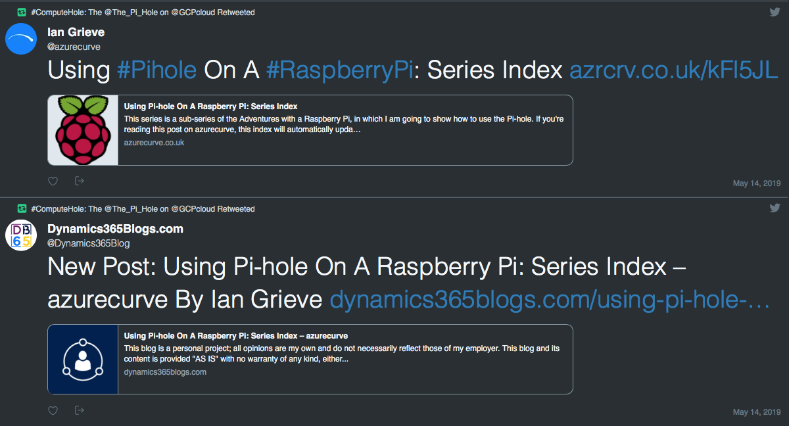
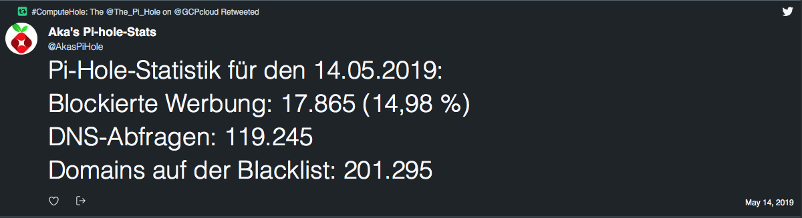
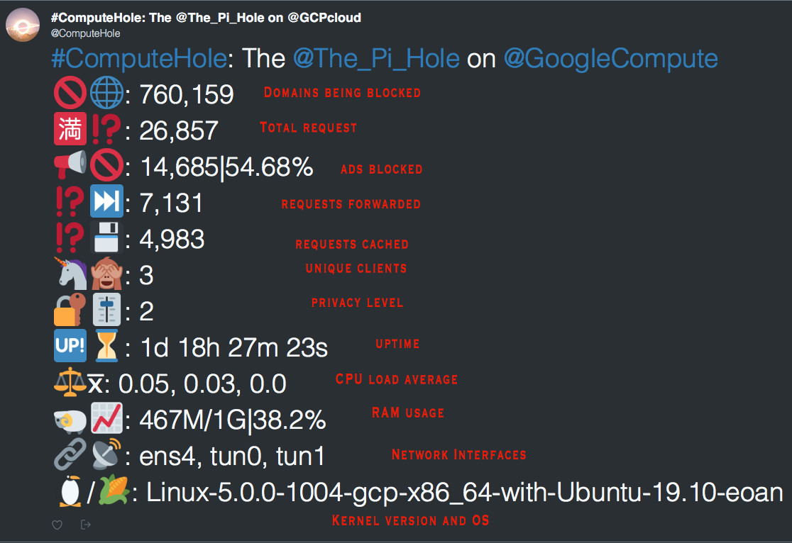
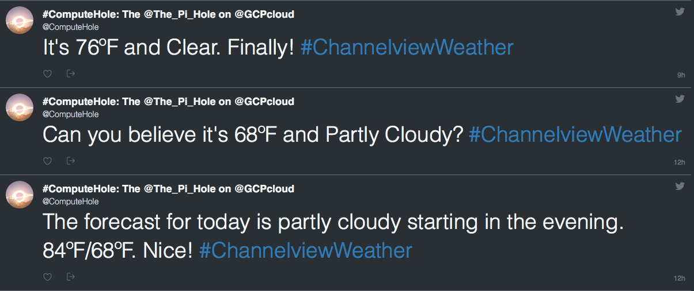

#### Table of Contents
  * [retweetBot](./README.md#retweetBot)

  * [tweetStats](./README.md#tweetStats)

  * [Third Example](./README.md#weatherBot)

# twitterBots

  * All the Twitter Bots used by [@ComputeHole](https://twitter.com/ComputeHole) on [Twitter](https://twitter.com/). 
  * All of them can be seen in action at https://twitter.com/ComputeHole. 
  
## retweetBot 

  * [mwoolweaver/retweetBot](https://github.com/mwoolweaver/retweetBot) forked from [MChambers1992/retweet-bot](https://github.com/MChambers1992/retweet-bot)
  
         
  
  
## tweetStats

  * [mwoolweaver/tweetStats](https://github.com/mwoolweaver/tweetStats) forked from [DarthKeizer/Pi-Hole-stats-tweeter](https://github.com/DarthKeizer/Pi-Hole-stats-tweeter)
  
  
  
## weatherBot

  * [mwoolweaver/weatherBot](https://github.com/mwoolweaver/weatherBot) forked from [BrianMitchL/weatherBot](https://github.com/BrianMitchL/weatherBot)
  
  
